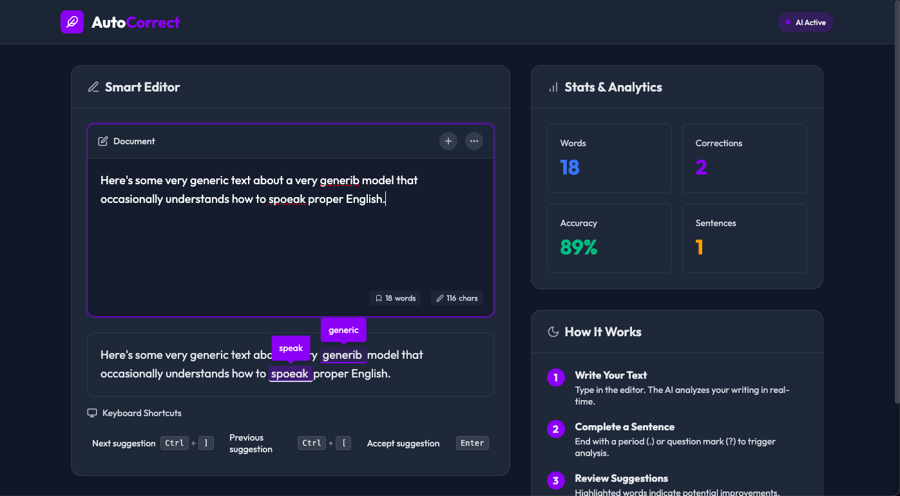

# Contextual AutoCorrect

## Overview
Contextual AutoCorrect is our machine learning model repository based on **T5**, fine-tuned to perform intelligent spelling and grammar correction while preserving context. This repository contains the FastAPI-based backend and a simple frontend interface for live text correction.

## Frontend Preview
Here’s a screenshot of the frontend (click the image to watch the demo video):

[](assets/Autocorrect_Demo.mp4)

## Contents
- **Context-aware corrections** for spelling and grammar.
- **FastAPI backend** for serving predictions.
- **Simple HTML/CSS/JS frontend** for real-time interaction.
- **Pretrained model checkpoints** available for download.
- **Jupyter notebook for fine-tuning experiments**.
- **Project reports detailing methodology and results**.

## Setup

### 1. Clone the Repository
```bash
git clone https://github.com/FA0206/ContextualAutoCorrect.git
cd ContextualAutoCorrect
```

### 2. Create and Activate the Conda Environment
Make sure you have Conda installed. Then run:
```bash
conda env create -f environment.yml
conda activate contextual-autocorrect
```

### 3. Download the Fine-Tuned Model
Due to GitHub's file size restrictions, the fine-tuned model is not stored in this repository. Download it from Google Drive:

[Download Model Checkpoints](https://drive.google.com/drive/folders/1wbRO1hPARBPcnkJ456GUGRCJFjE7na88?usp=drive_link)  

Download `phase_3_hard_checkpoint.zip` and unzip it. Place the model folder inside the project directory as follows:
```
ContextualAutoCorrect/
│── Finetuned Models/
│   ├── phase_3_hard_checkpoint/
```

### 4. Run the API Server
Start the FastAPI server using Uvicorn:
```bash
uvicorn main:app --reload
```
The API will be available at **http://127.0.0.1:8000/**.

### 5. Access the Frontend
Open a browser and go to:
```
http://127.0.0.1:8000/
```

## File Structure
```
ContextualAutoCorrect/
│── main.py                 # FastAPI server
│── static/                 # Frontend assets
│   ├── css
│   │   ├── style.css
│   ├── js
│   │   ├── scripts.js
│── templates/              # HTML templates
│   ├── index.html
│── assets/                 # Screenshots and Demo Video
│   ├── Autocorrect_Demo.mp4
│   ├── screenshot.png
│── Finetuned Models/       # Model checkpoint folder (to be added manually)
│── ML/                     # Jupyter notebook for model fine-tuning
│   ├── autocorrectfinetunet5.ipynb
|   │── Reports/                # Project reports
│   │   ├── AutoCorrect_Report_2.pdf
│   │   ├── AutoCorrectComplete_Mid_Term_Report.pdf
│── environment.yml         # Conda environment dependencies
│── README.md               # Project documentation
```

